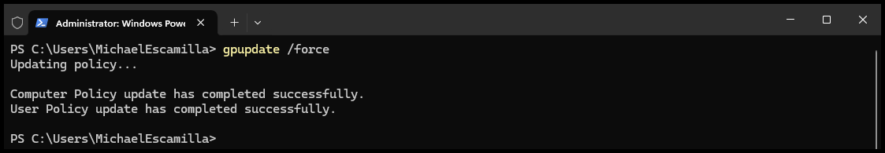

# Group Policy - Toolkit LogPath

## Introduction

In this example, we will create a Group Policy Object to define the log path for our PSADT 4.1.x package deployments.

This provides the benefit of:
- Standardizing your PSADT deployment logging location
- Not having to config each deployment package with the correct log path

Assumptions:
- You need to have already imported the ADMX Templates into your Central Store.

## Create a new Group Policy Object

 - Start by opening the Group Policy Management Editor
 - Then Right-Click on 'Group Policy Objects' and select 'New' 

 

 - Enter a name
    - In this example, I'm using `PSADT 4.1`

 

## Edit the Group Policy Object

- After creating the GPO, find it under `Group Policy Objects`
- Right-Click and select `Edit`

 

- Expand down to `Toolkit`
- Right-Click on `LogPath` and select `Edit`

 ```
Computer Configuration
└───Policies
    └───Administrative Templates: Policy definitions
        └───PSAppDeployToolkit
            └───Toolkit
```

 

 - Select `Enable`, and then define a Path.
 - In this example, I'm using the Intune Management Extension Log folder:

 ```powershell
 $envProgramData\Microsoft\IntuneManagementExtension\Logs
 ```


- Select `OK` to close the Policy window
- Configure any other desired policies
- Close the Policy Editor window

## Link the GPO

Now that we have the GPO created and configured, lets link it to the domain or desired OU.

- Navigate to the Desired location you want to link the GPO
- Right-Click and select `Link an Existing GPO...`


- Select the previously created and configured policy and then click `OK`


- You will now see the GPO Linked to the location you select


## Update Group Policy

On a machine that is scoped for the policy, run the below command to update Group Policy

```
gpupdate /force
```



## Verify the Group Policy Applied

You can verify the status of the policy by running the below command

```
gpresult /r /scope computer
```


### Verify the Policies in the Registry

You should see the setting applied within the Registry

```
Computer\HKEY_LOCAL_MACHINE\SOFTWARE\Policies\PSAppDeployToolkit\Config\Toolkit
```


## Run a Deployment

Now when a deployment is run, PSAppDeployToolkit will import any settings in Group Policy as it initializes.

Below we can see that the deployment is running and the log file was created in the `ProgramData\Microsoft\IntuneManagementExtension\Logs` folder

