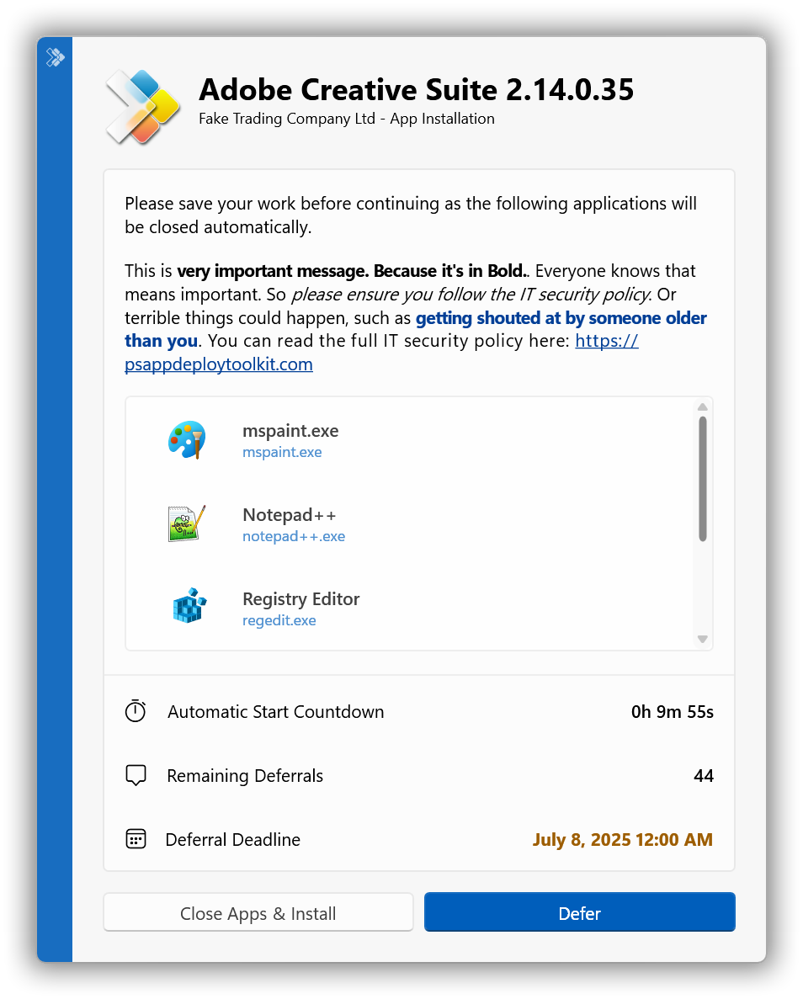
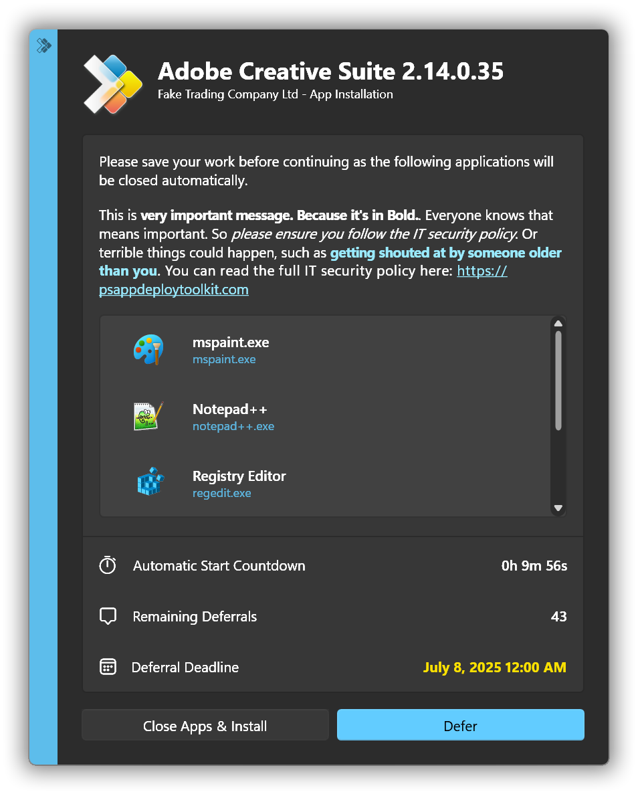
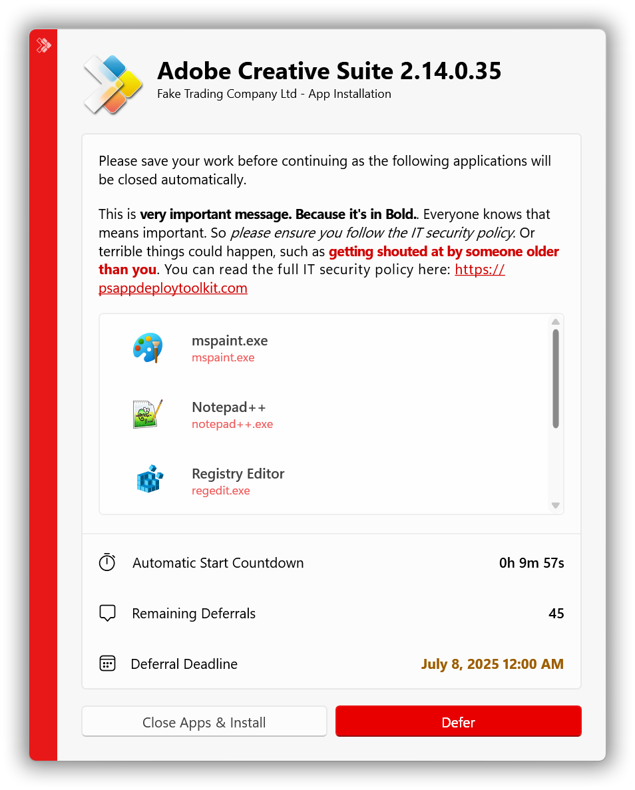
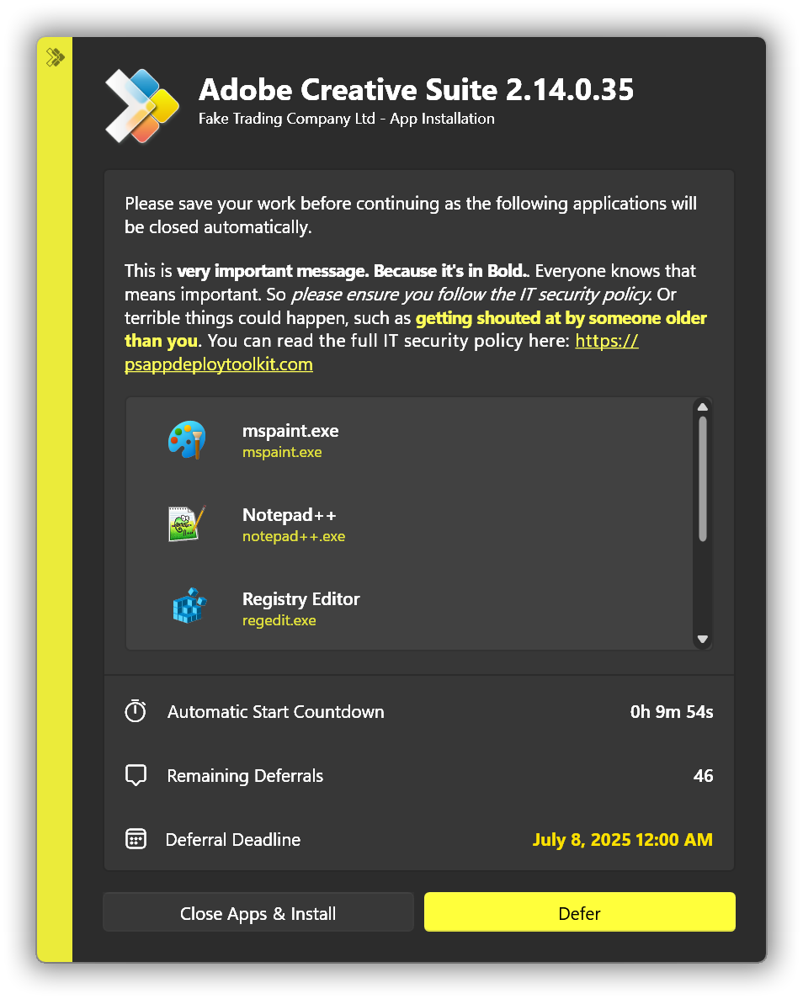

# Changes in PSAppDeployToolkit 4.1

## Highlights

- **Removed** ServiceUI requirement for Intune deployments and 'Allow users to view and interact with the program installation' checkbox for Configuration Manager deployments.

  - I REPEAT! You no longer need to use ServiceUI, EVER AGAIN! 🥳🎉🎊🪅🪩👯‍♂️
  - In fact, we strongly advise you stop using it as soon as possible. ServiceUI works by manipulating system security tokens in a way that could allow malicious actors to escalate privileges or bypass security controls.
  - We've taken a fresh approach which leverages the Windows security model and separates out user interactions onto a process running in the users' session - we never perform any user interaction or messaging of any kind within the SYSTEM context. This means a more secure and reliable deployment experience.
  - We have also removed the requirement for the 'Allow users to view and interact with the program installation' checkbox in Configuration Manager deployments.

- **Added** feature parity between Fluent UI and Classic UI:
  - Deferral Deadline and Countdown Timer on Close Apps Dialog
  - Support for moveable dialogs, and multiple dialog placement options
- **Enhanced** Fluent UI with:
  - Support for formattable text (Bold, Italic & Accent) as well as URL hyperlinks in dialog messages
  - Progress dialog now supports setting progress bar values
  - User text input prompts via [Show-ADTInstallationPrompt's](../reference/functions/Show-ADTInstallationPrompt.mdx) -InputBox parameter
- **Enhanced** [Start-ADTProcess](../reference/functions/Start-ADTProcess.mdx) / [Start-ADTProcessAsUser](../reference/functions/Start-ADTProcessAsUser.mdx) with multiple new parameters:
  - -UseUnelevatedToken parameter to force a process run without elevation, for deploying user-context apps with Windows 11 Administrator Protection enabled
  - -WaitForChildProcesses parameter to wait for all child processes to end - useful for installers/uninstallers that hand off to another process and exit early
  - -KillChildProcessesWithParent parameter to close all started child processes once main process has ended - useful when installers start the application post-install, which is typically undesired when running as system
  - -Timeout parameter along with supporting -TimeoutAction and -NoTerminateOnTimeout parameters to control the outcome
  - -ExpandEnvironmentVariables parameter to allow variable expansion such as %AppData% when running a process as a user
  - -StreamEncoding parameter, useful for apps like Winget that write to the console using UTF8
  - -PassThru output now has a new 'interleaved' property that combines stdout/stderr in order
- **Improved** [Show-ADTHelpConsole](../reference/functions/Show-ADTHelpConsole.mdx) with High-DPI awareness, resizability, PowerShell 7 compatibility, and extension module display
- **Added** ADMX templates for policy-based management

### Other User Interface Improvements

- **Added** Fluent UI support for different icons in light/dark modes
- **Added** Fluent UI support for moveable dialogs and multiple dialog placement options
- **Added** -NoWait support to [Show-ADTDialogBox](../reference/functions/Show-ADTDialogBox.mdx)
- **Added** PowerShell ISE compatibility to Fluent UI
- **Added** process detection code to enable automatic silent deployments when processes aren't running

### Example Screenshots

## Added

### New Functions
- **Added** functions for managing user/machine environment variables
- **Added** functions for managing INI sections/values
- **Added** -DeferRunInterval switch to [Show-ADTInstallationWelcome](../reference/functions/Show-ADTInstallationWelcome.mdx) to limit retry times from Intune
- **Added** -Path / -LiteralPath support to registry functions
- **Added** volatile key creation support to [Set-ADTRegistryKey](../reference/functions/Set-ADTRegistryKey.mdx)
- **Added** MultiString add / remove support to [Set-ADTRegistryKey](../reference/functions/Set-ADTRegistryKey.mdx)
- **Added** -MaximumElapsedTime parameter to [Invoke-ADTCommandWithRetries](../reference/functions/Invoke-ADTCommandWithRetries.mdx)
- **Added** -SuccessExitCodes and -RebootExitCodes parameters to [Uninstall-ADTApplication](../reference/functions/Uninstall-ADTApplication.mdx)

### Other Improvements

- **Added** /Debug switch to [Invoke-AppDeployToolkit.exe](../usage/invoke-appdeploytoolkit.mdx) to show terminal output for debugging purposes
- **Added** /Core switch to [Invoke-AppDeployToolkit.exe](../usage/invoke-appdeploytoolkit.mdx) to allow PowerShell 7 usage
- **Added** LogToHierarchy / LogToSubfolder options in [Config.psd1](../reference/config-settings.mdx) to allow logs to be created under subfolders

## Fixed

- **Fixed** [Start-ADTProcessAsUser](../reference/functions/Start-ADTProcessAsUser.mdx) function to work as expected
- **Fixed** [Block-ADTAppExecution](../reference/functions/Block-ADTAppExecution.mdx) to avoid triggering AV solutions
- **Fixed** dialogs to show correct deployment type Install / Uninstall / Repair
- **Fixed** SCCM pending reboot tests within [Get-ADTPendingReboot](../reference/functions/Get-ADTPendingReboot.mdx)
- **Fixed** MSI repair to default to 'Reinstall' to avoid forced unavoidable reboots when running msiexec /f against an app that is in-use
- **Fixed** OOBE detection code to factor in User ESP phase

## Changed

- **Changed** default DeferExitCode from 60012 to 1602, since ConfigMgr and Intune recognize this natively as 'User cancelled the installation'
- **Changed** toolkit to exit with 3010 if a suppressed reboot was encountered without having to use -AllowRebootPassThru. To mask 3010 return codes and exit with 0, you can now add -SuppressRebootPassThru
- **Changed** default msiexec.exe parameters in interactive mode from /qb-! to /qn
- **Changed** UI functions to no longer minimize windows by default, -MinimizeWindows can be added to enable this
- **Changed** template: Processes to close moved to ADTSession parameters, where they can be re-used over Install / Uninstall / Repair
- **Changed** installation failure to be silent as it was in v3.x; however, you can still uncomment a line to get the full detailed stack trace as used in v4.0.x, or a new minimal example using the Fluent UI
