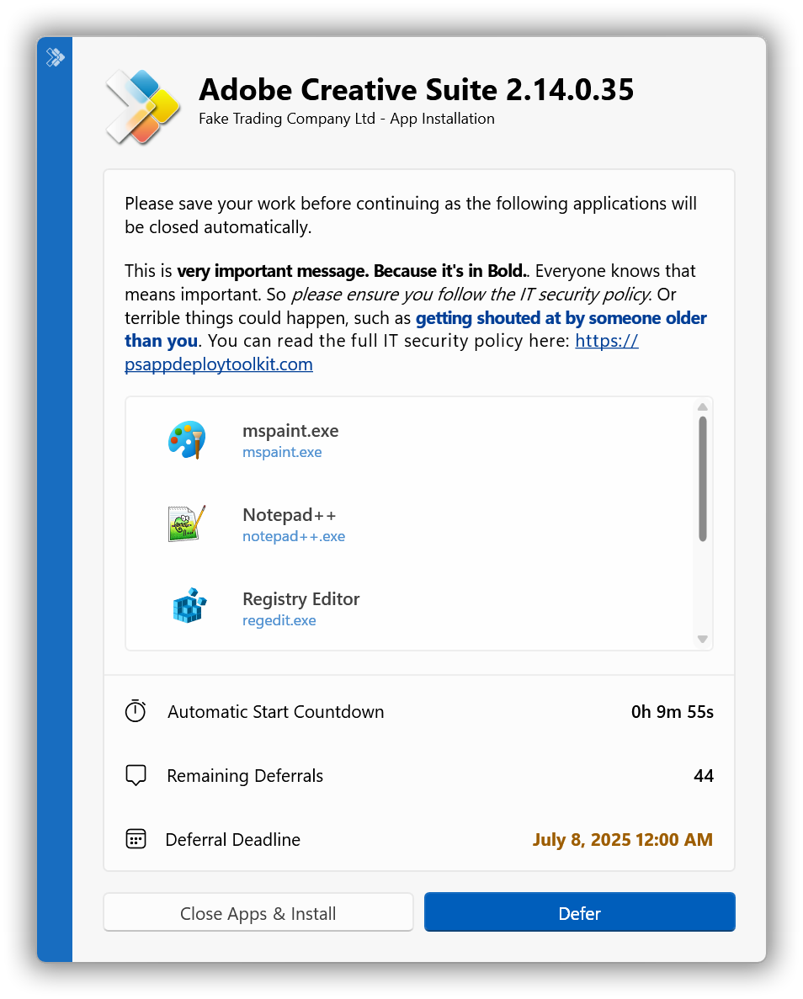
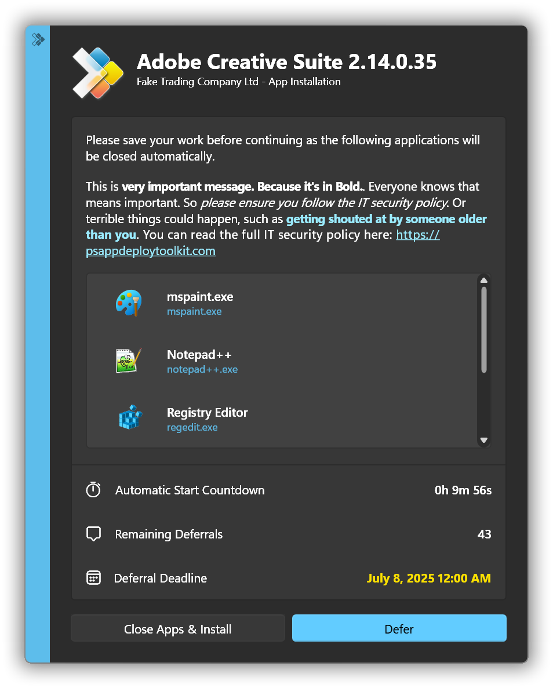
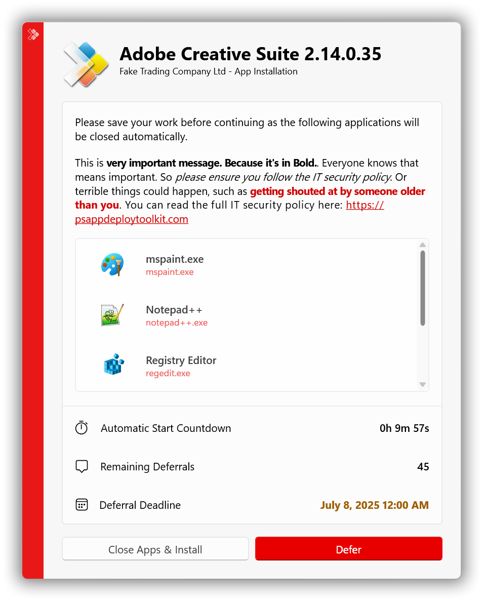
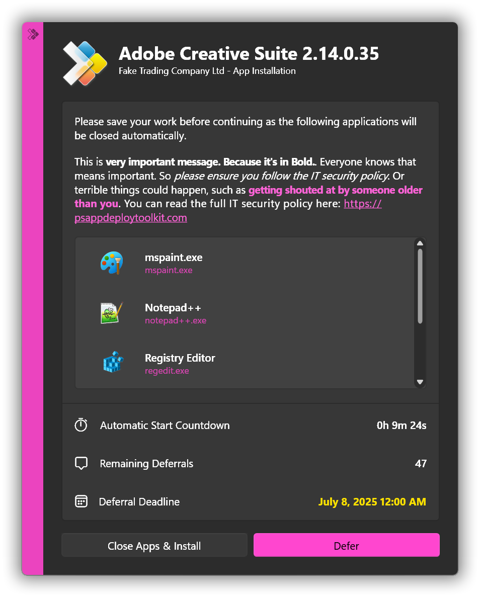
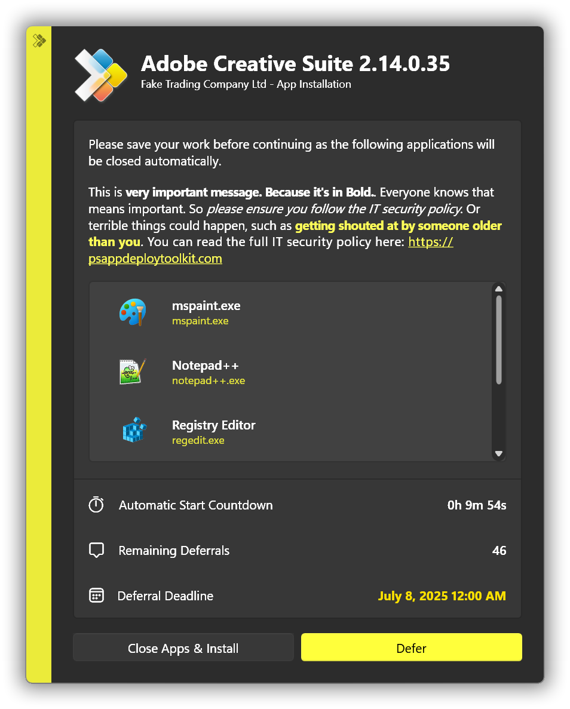

---
sidebar_position: 5
title: 'Release Notes'
description: 'Release notes for PSAppDeployToolkit v4.1'
slug: /getting-started/release-notes
hide_title: true
tags:
  - Changes
  - Getting Started
---

## Release Notes

### v4.1.8 (2026-01-14)

#### Highlights

This release strengthens Windows Installer (.msi) and Patch (.msp) deployment reliability, improves process and handle safety, enhances dialog behavior, and hardens serialization and exception reporting. It also modernizes dependencies and standardizes UTF-8 handling.

#### Added

- Added automatic MSP logging within `Start-ADTMsiProcess`
- Added support for MSI patches that target multiple product codes
- Added `-PassThru` result for `Start-ADTMsiProcess` when an MSI isn't installed on the system
- Added `Start-ADTMsiProcess` logging parameters to `Start-ADTMspProcess`
- Added automatic dialog repositioning when screen resolution changes
- Added `IsAdmin` property to `RunAsActiveUser` object

#### Changed

- Changed `Test-ADTNetworkConnection` to include Wi-Fi connections by default
- Changed `Start-ADTMsiProcess` and `Start-ADTMspProcess` parameters to be fully harmonized
- Changed PowerShell InformationStream to use `Write-Host` again for transcription support
- Changed `Show-ADTInstallationPrompt` command in template to remove `-Icon` parameter (not supported in Fluent UI)
- Changed ESP detection to not require `CloudAssignedTenantId` (to support Windows 365 devices)
- Changed permissions checks to occur earlier in `ProcessManager.CreateProcessUsingToken()`
- Changed `FileHandleManager.GetOpenHandles()` to use ordinal string comparison for object names
- Changed `FileHandleManager.GetOpenHandles()` to only test for disk file handles
- Changed child processes to no longer inherit duplicated handles
- Changed `ProcessUtilities.GetProcessImageName()` to improve exception reporting
- Changed `ProcessUtilities.GetProcessArgv()` to improve error capturing

#### Fixed

- Fixed `Start-ADTMsiProcess` checking if `$msiDefaultParams` exist before adding to `$msiArgs`
- Fixed `Start-ADTMsiProcess` exception caused by `InstalledApplication` object handling
- Fixed Zero-Config MSI code to use the `FileName` column
- Fixed outer-quoted command line arguments incorrectly parsing as key/value pairs
- Fixed `ProcessManager.LaunchAsync()` disposal issues
- Fixed `ProcessManager.LaunchAsync()` exit code handling
- Fixed module file encoding to use UTF-8 with BOM
- Fixed deserialization checks to handle missing data
- Fixed handling of malformed input in `DataSerialization.SerializeToString()`
- Fixed `SafeThreadHandle` implementation where the handle was not releasing
- Fixed `DialogManager.ShowBalloonTip()` disposal
- Fixed `Start-ADTMsiProcess` to handle MSI files without `ProductVersion`
- Fixed `MsiUtilities.GetMessageFromMsiExitCode()` null terminator handling
- Fixed `Block-ADTAppExecution` to work on `ProcessDefinition` objects
- Fixed `Invoke-ADTAllUsersRegistryAction` help to use `-LiteralPath` instead of `-Key`
- Fixed arithmetic overflow in error handling utilities
- Fixed `SafeHandle` disposal for processes we don't own
- Fixed desktop icon cache refresh
- Fixed `DeploymentSession.AppVendor` field for Zero-Config MSI deployments
- Fixed `AssemblyPermissions.Remediate()` exception details
- Fixed `process.HasExited` checks within `ProcessUtilities.GetRunningProcesses()`
- Fixed Turkish locale issues with case conversion (invariant `ToUpper`/`ToLower`)
- Fixed `Close-ADTSession` break behavior in breakable statements
- Fixed `Show-ADTInstallationWelcome` infinite dialog loop when processes can't be closed by user
- Fixed `/Debug` mode to only work in user interactive processes
- Fixed `Start-ADTProcessAsUser` missing `Default_CreateWindow_Wait` parameter set
- Fixed hidden files/folders not being copied when referenced directly
- Fixed `Get-ADTUserNotificationState` return type
- Fixed `Copy-ADTContentToCache` error on re-run when source and destination are the same
- Fixed `hStdInput` handle to use `INVALID_HANDLE_VALUE` when not in use
- Fixed `FileHandleManager.GetOpenHandles()` to skip invalid file handles

### v4.1.7 (2025-10-21)

#### Fixes

- Hotfix to resolve issue where PSAppDeployToolkit 4.1.6 did not work in PowerShell 7

### v4.1.6 (2025-10-17)

#### Improvements

- Added the ability to format URLs with a description using tags in dialog strings, e.g. `[url=https://contoso.com/security]Click here for the IT Security Policy[/url]`
- Added support for nested tags for UI text formatting
- Changed `-TerminalServerMode` switch behavior so that if not running in a terminal server, no action is taken
- Changed Fluent Dialogs to use software rendering-mode which resolves issues with remote assistance / control tools, e.g. ScreenConnect

#### Fixes

- Fixed an issue where the UI may fail to be displayed when `explorer.exe` is being elevated by an EPM rule using BeyondTrust EPM, Microsoft EPM, or other EPM tool
- Fixed an issue where `Get-ADTApplication` could error out if `InstallSource` / `InstallLocation` properties were malformed
- Fixed an issue where `Get-ADTLoggedOnUser` would not return any output when pipelined, unless it was encapsulated in a subexpression
- Fixed `Start-ADTProcessAsUser` to work with the callers' username even if it doesn't have an active session
- Fixed issue where tags specified in dialog strings were incorrectly being displayed in Classic Dialogs
- Fixed passing parameters from the command-line to a v3 compatibility template
- Fixed Fluent Window dialog position to factor in the default offset if changed
- Fixed a number of issues found in example documentation for `Show-ADTInstallationPrompt`, `Get-ADTExecutableInfo` and `Start-ADTProcess`
- Fixed `Start-ADTProcess -ArgumentList` parameter incorrectly resolving custom `$adtSession` property to `True`
- Fixed `Test-ADTOobeCompleted` and `Test-ADTEspActive` not working
- Fixed `Set-ADTServiceStartMode` error handling bug
- Fixed `Set-ADTActiveSetup -Description` parameter could not be specified in parameter set `CreateNoExecute`
- Fixed unexpected error output when reading a HKLM key in SID context
- Fixed all known `Copy-ADTFile` issues
- Fixed `New-ADTZipFile` not working
- Fixed issue where `Start-ADTMsiProcess` could fail to uninstall an installed MSI
- Fixed `Remove-ADTEnvironmentVariable` just removing the variable's value, not the variable itself
- Fixed `Get-ADTShortcut` no longer working for URL shortcuts

### v4.1.5 (2025-09-07)

#### Fixes

- Added more error info to assist with troubleshooting issue
- Fixed issue that prevented the toolkit running under some Intune deployments
- Added a fallback default icon where we're unable to obtain one from a running process
- Fixed issue where `Get-ADTShortcut` hit an error when the icon path contained an environment variable
- Fixed `OutOfMemoryException` issues within `Resolve-ADTErrorRecord`

### v4.1.4 (2025-09-04)

#### Improvements

- Changed to allow IFEO-blocked processes that get invoked as SYSTEM to execute.
- Added warning within `Block-ADTAppExecution` if generated command line is > 255 chars
- Added `-DisableInheritance` switch to `Set-ADTItemPermission` to restore 3.x behaviour for those who want it.
- Added `IsTerminalServer` to `New-ADTEnvironmentTable` exports
- Updated `Show-ADTInstallationWelcome` documentation
- Changed to using `GetLastInputInfo()` for more accurate console user idle time.
- Changed `Exit-ADTInvocation` to expose `-NoShellExit` parameter on `Close-ADTSession`.
- Made the fluent dialogs properly honour right-to-left cultures

#### Fixes

- Fixed quote handling in `InstallSource` and `InstallLocation` properties in `Get-ADTApplication`
- Set default parameter set for `Start-ADTMspProcess`.
- Changed `Start-ADTMsiProcessAsUser` to ensure it uses a user-writeable log location.
- Fixed bad parameter set grouping for `Start-ADTProcess` family of functions.
- Fixed issue where `Set-ADTItemPermissions` always needed admin rights to change inheritance options
- Fixed issue where `Set-ADTActiveSetup` `-PurgeActiveSetupKey` would only clean up keys for the active user.
- Fixed `StdOut`/`StdErr`/`Interleaved` printing within `Start-ADTProcess`.
- Changed `Start-ADTProcessAsUser` to allow operating with any valid user, such as disconnected RDP users.
- Changed `DeploymentSession` to handle situations where people put curly braces into `InstallTitle`.
- Improved version handling within `Set-ADTActiveSetup`
- Fixed dynamic code trust verification issues with iNKORE dlls
- Fixed access denied issues when querying running processes
- Fixed "Exception calling TestEffectiveAccess" issue
- Fixed `ShowCloseAppsDialog` issue [#6904](https://discourse.psappdeploytoolkit.com/t/v4-1-3-show-adtinstallationwelcome-closeprocesses-isnt-working/6904)
- Fixed `ZeroConfig` issue
- Fixed `PSADT.AccountManagement.AccountUtilities` exception [#6890](https://discourse.psappdeploytoolkit.com/t/4-1-3-show-adtballoontip-the-client-process-returned-an-exception-access-denied/6890)
- Fixed issue with users being able to terminate the PSADT UI [#6899](https://discourse.psappdeploytoolkit.com/t/4-1-3-show-adtinstallationrestartprompt-task-manager/6899)
- Fixed issue with launching `ServiceUI.exe` via `Start-ADTProcess` [#6896](https://discourse.psappdeploytoolkit.com/t/4-1-3-trying-to-display-a-command-prompt-using-serviceui/6896)
- Fixed client/server UI permissions issue [#6905](https://discourse.psappdeploytoolkit.com/t/4-1-3-adt-ui-system/6905)

### v4.1.3 (2025-08-21)

#### Fixes

- Fixed `CloseProcesses` issue introduced in in 4.1.2
- Fixed issue with variable expansion on `Start-ADTProcessAsUser`
- Fixed `Uninstall-ADTApplication` to work with 8.3 names (e.g. `C:\PROGRA~2`)

### v4.1.2 (2025-08-20)

#### Fixes

- Fixed issue with `TestEffectiveAccess()` call in `Set-ADTClientServerProcessPermissions` that would fail on some domain-joined devices
- Fixed setup in `Block-ADTAppExecution` so processes started by `SYSTEM` don't block at all
- Fixed issue with `Show-ADTInstallationWelcome` where the buttons would always display in English

### v4.1.1 (2025-08-19)

#### Improvements

- Prevent end users from terminating `PSADT.ClientServer.Client.exe` process
- Do things to try and make the IFEO command line as short as possible
- Add better retry support to all modal dialogs to prevent client termination
- Allow `-ErrorAction` to handle no available user in `Start-ADTProcessAsUser`
- Address case where some systems seemingly don't have a `Win32_BIOS.Version` property
- Add `FileSystemUtilities.TestFileAccess()` for testing whether a user has the relevant permissions
- Add `FileSystemUtilities.GetEffectiveAccess()` to determine whether a `SID` has effective access to a path
- Rework `Set-ADTClientServerProcessPermissions` to test for effective access rather than just attempting to set `ACLs`
- Improve setup surrounding `-UseShellExecute` pathway, especially with `UIAccess` executables
- Handle situations where we might not have access to the process in `ProcessUtilities.GetRunningProcesses()`
- Adjust `Set-ADTClientServerProcessPermissions` to not require a client/server user
- Get all the `*-ADTEnvironmentVariable` functions running through the client/server process when the `Target` is `User`
- Run the client/server process elevated if the user has a linked admin token
- Bump `InvokeBuild` dependency version to latest upstream
- Ensure log lines from `Show-ADTInstallationProgress` reflect all inputs
- Improve comment-based help several functions within the module
- Add missing `[SupportsWildcards()]` decoration for `Remove-ADTFolder` `-Path`
- Ensure there's no duplicate `-AppProcessesToClose` entries, just like `Show-ADTInstallationWelcome` does
- Uplift `-FilePath` resolution in `Start-ADTProcess` to factor in `DirFiles`/`DirSupportFiles` if `-WorkingDirectory` is not specified
- No need to be so restrictive on `Start-ADTMsiProcess` `-LogFileName`
- Expose `RequireAdmin` publicly within `DeploymentSession` class object
- Added Bulgarian language strings.

#### ️ Fixes

- Adjust setup in `ProcessUtilities.GetRunningProcesses()` to handle bogus command lines
- Patch bad setup in `Get-ADTClientServerUser` when multiple users are present
- Fix some incorrectly named languages so they confirm with `bcp47` standards
- Restore `SEE_MASK_NOZONECHECKS` setup in `Start-ADTProcess` as it's needed even for `CreateProcess()`
- Add missing parentheses within `New-ADTTemplate` `-Show` pathway
- Swallow `TaskCanceledException` throws within `ServerInstance.Close()`
- Properly set the `Company` field in all compiled file manifests
- Revise setup surrounding default setting of `$WorkingDirectory` in `Start-ADTProcess`
- Fixes for Finnish language strings.
- Fix missing negation on `DisableDefaultMsiProcessList` test

### v4.1 (2025-08-07)

#### Major Improvements

- Up until now, it was not possible to display any user interface when deploying an application as SYSTEM using Intune (or any endpoint management tool) without using ServiceUI. Well, now it IS possible:
  - In fact, we strongly advise you stop using it as soon as possible. ServiceUI works by manipulating system security tokens in a way that could allow malicious actors to escalate privileges or bypass security controls.
  - We've taken a fresh approach which leverages the Windows security model and separates out user interactions onto a process running in the users' session - we never perform any user interaction or messaging of any kind within the SYSTEM context. This means a more secure and reliable deployment experience.
  - We have also removed the requirement for the 'Allow users to view and interact with the program installation' checkbox in Configuration Manager deployments.

- There is now **full feature parity** between the Fluent and Classic User Interfaces:
  - Deferral Deadline and Countdown Timer on Close Apps Dialog
  - Ability to prevent the Restart Dialog from being dismissed once a certain point in the countdown is reached
  - Ability to allow users to move dialogs
  - Ability to set the initial dialog placement to multiple locations
  - PowerShell ISE compatibility

- Furthermore, the Fluent UI has gained new features:
  - Due to the rearchitecture of how we handle user interaction with Dialogs, it is now possible to prompt the user for input using [Show-ADTInstallationPrompt](../reference/functions/Show-ADTInstallationPrompt)'s `-InputBox` parameter
  - Support for formattable text (Bold, Italic & Accent) as well as URL hyperlinks in dialog messages
  - You can now set the % complete of the progress bar in the Progress Dialog (for example, if you are running a custom script that you want to show incremental progress changes for)
  - Ability to set different icons for Light / Dark mode

- The security rearchitecture required all of our process execution code to be rewritten. This has enabled us to provide a wealth of new capabilities to both [Start-ADTProcess](../reference/functions/Start-ADTProcess) and [Start-ADTProcessAsUser](../reference/functions/Start-ADTProcessAsUser) using the following new parameters:
  - `-UseUnelevatedToken` parameter to force a process run without elevation, for deploying user-context apps with Windows 11 Administrator Protection enabled
  - `-WaitForChildProcesses` parameter to wait for all child processes to end - useful for installers/uninstallers that hand off to another process and exit early
  - `-KillChildProcessesWithParent` parameter to close all started child processes once main process has ended - useful when installers start the application post-install, which is typically undesired when running as system
  - `-Timeout` parameter along with supporting `-TimeoutAction` and `-NoTerminateOnTimeout` parameters to control the outcome
  - `-ExpandEnvironmentVariables` parameter to allow variable expansion such as `%AppData%` when running a process as a user
  - `-StreamEncoding` parameter, useful for apps like `Winget` that write to the console using `UTF8`
  - `-PassThru` output now has a new `interleaved` property that combines `stdout`/`stderr` in order
- It's now possible to set PSADT configuration settings via Group Policy using the included ADMX templates, which will override any settings in the `config.psd1` file. This allows you to change, update or enforce settings across an organization.

#### ️ New and Enhanced Functions

- Added functions for managing user / machine environment variables:
  - [Get-ADTEnvironmentVariable](../reference/functions/Get-ADTEnvironmentVariable) / [Set-ADTEnvironmentVariable](../reference/functions/Set-ADTEnvironmentVariable) / [Remove-ADTEnvironmentVariable](../reference/functions/Remove-ADTEnvironmentVariable)
- Added functions for managing INI file sections / values:
  - [Get-ADTIniSection](../reference/functions/Get-ADTIniSection) / [Set-ADTIniSection](../reference/functions/Set-ADTIniSection) / [Remove-ADTIniSection](../reference/functions/Remove-ADTIniSection)
  - [Get-ADTIniValue](../reference/functions/Get-ADTIniValue) / [Set-ADTIniValue](../reference/functions/Set-ADTIniValue) / [Remove-ADTIniValue](../reference/functions/Remove-ADTIniValue)
- Added [Start-ADTMsiProcessAsUser](../reference/functions/Start-ADTMsiProcessAsUser) for installing / uninstalling user-context MSIs via the System account
- Added [Test-ADTEspActive](../reference/functions/Test-ADTEspActive) to test for an active Enrollment Status Page (ESP)
- Added `-DeferRunInterval` switch to [Show-ADTInstallationWelcome](../reference/functions/Show-ADTInstallationWelcome) to limit retry times from Intune
- Added `-Path` / `-LiteralPath` support to registry functions
- Added volatile key creation support to [Set-ADTRegistryKey](../reference/functions/Set-ADTRegistryKey)
- Added `MultiString` add / remove support to [Set-ADTRegistryKey](../reference/functions/Set-ADTRegistryKey)
- Added `-MaximumElapsedTime` parameter to [Invoke-ADTCommandWithRetries](../reference/functions/Invoke-ADTCommandWithRetries)
- Added `-SuccessExitCodes` and `-RebootExitCodes` parameters to [Uninstall-ADTApplication](../reference/functions/Uninstall-ADTApplication)

#### ️ Other Improvements

- [Show-ADTHelpConsole](../reference/functions/Show-ADTHelpConsole) has been given some love and a facelift with High-DPI awareness, resizability, PowerShell 7 compatibility, and extension module display
- Reworked `Invoke-AppDeployToolkit.exe` to be more compliant within `WDAC` environments
- Added `-NoWait` support to [Show-ADTDialogBox](../reference/functions/Show-ADTDialogBox)
- Added process detection code to enable automatic silent deployments when processes aren't running
- Added `/Debug` switch to [Invoke-AppDeployToolkit.exe](../deployment-concepts/invoke-appdeploytoolkit) to show terminal output for debugging purposes
- Added `/Core` switch to [Invoke-AppDeployToolkit.exe](../deployment-concepts/invoke-appdeploytoolkit) to allow PowerShell 7 usage
- Added support for running processes from network drives

#### ️ Changes

- Added `-NoOobeDetection` option to `Open-ADTSession` to bypass `OOBE` detection logic when `DeployMode` is set to `Auto`. Use this to show the UI during `OOBE` / Autopilot `ESP` phases.
- Added `-NoSessionDetection` option to `Open-ADTSession` to bypass session detection logic when `DeployMode` is set to `Auto`. Use this to show the UI when no user is logged on and the `SYSTEM` process is interactive.
- Added `-NoProcessDetection` option to `Open-ADTSession` to bypass process detection logic when `DeployMode` is set to `Auto`. Use this to show the UI even if there are no processes to close.
- Changed `-DeployMode` `Interactive` to always show interactively. This means the toolkit will always show the dialogs, bypassing the `OOBE`/`Session`/`Process` detections that occur in `Auto` mode.
- Changed default `DeferExitCode` from `60012` to `1602`, since `ConfigMgr` and Intune recognize this natively as 'User cancelled the installation'
- Changed toolkit to exit with `3010` if a suppressed reboot was encountered without having to use `-AllowRebootPassThru`. To mask `3010` return codes and exit with `0`, you can now add `-SuppressRebootPassThru`
- Changed default `msiexec.exe` parameters in interactive mode from `/qb-!` to `/qn`
- Changed UI functions to no longer minimize windows by default, `-MinimizeWindows` can be added to enable this
- Changed the 'Processes to close' in the `Invoke-AppDeployToolkit` template to the `AppProcessesToClose` `ADTSession` parameter, where they can be re-used over Install / Uninstall / Repair
- Changed installation failure to be silent as it was in v3.x; however, you can still uncomment a line to get the full detailed stack trace as used in v4.0.x, or a new minimal example using the Fluent UI

#### Fixes

- Fixed [Start-ADTProcessAsUser](../reference/functions/Start-ADTProcessAsUser) function to work as expected
- Fixed [Block-ADTAppExecution](../reference/functions/Block-ADTAppExecution) to avoid triggering AV solutions
- Fixed dialogs to show correct deployment type Install / Uninstall / Repair
- Fixed `SCCM` pending reboot tests within [Get-ADTPendingReboot](../reference/functions/Get-ADTPendingReboot)
- Fixed MSI repair to default to 'Reinstall' to avoid forced unavoidable reboots when running `msiexec` `/f` against an app that is in-use
- Fixed `OOBE` detection code to factor in User `ESP` phase
- Fixed launching processes in the users' session when using certain MDMs, e.g. VMware Workspace ONE.

#### Screenshots

|               Light Mode               |               Dark Mode               |
| :------------------------------------: | :-----------------------------------: |
|  |  |
|                                        |                                       |

|         Custom Accent in Light Mode          |          Custom Accent in Dark Mode           |
| :------------------------------------------: | :-------------------------------------------: |
|  |    |
|                                              |  |

### v4.0

#### Overview

- Added modern Fluent user interface
- Added digitally signed PowerShell module
- Changed all C# code to be compiled
- Changed codebase with complete refactoring and optimization
- Removed all VBScript code
- Added strongly typed and defined object types (no more PSCustomObjects, etc.)
- Added defensive coding to ensure security and reliability
- Added PowerShell 7 and ARM support
- Added extensions support as supplemental modules
- Added custom action support for extensions on deployment start and finish
- Added support for overriding config via the registry
- Added backwards-compatibility with v3 deployment scripts

#### Key Filename Changes

:::info
Further changes to the deployment layout are detailed in the [Deployment Structure](../deployment-concepts/deployment-structure.mdx) page.
:::

| Old Name                     | New Name                      | More Information                                                              |
| :--------------------------- | :---------------------------- | :---------------------------------------------------------------------------- |
| `Deploy-Application.ps1`     | `Invoke-AppDeployToolkit.ps1` | [Invoke-AppDeployToolkit](../deployment-concepts/invoke-appdeploytoolkit.mdx) |
| `Deploy-Application.exe`     | `Invoke-AppDeployToolkit.exe` | [Invoke-AppDeployToolkit](../deployment-concepts/invoke-appdeploytoolkit.mdx) |
| `AppDeployToolkitConfig.xml` | `Config\Config.psd1`          | [Configuration Settings](../reference/config-settings.mdx)                    |
| *Was part of Config file*    | `Strings\Strings.psd1`        | [Language Strings](../reference/language-strings.mdx)                         |

#### New Configuration Format

- Changed to .psd1 as the native PowerShell config file format. See [Customizing Deployments](../usage/customizing-deployments.mdx) for more information.

#### Key Function Name Changes

:::info
For a detailed mapping of all v3 to v4 functions, see the [Function Mapping](../reference/v4-function-mapping.mdx) page.
:::

- Changed certain function names to avoid collisions with other scripts or modules.

| Old Name          | New Name / Details                                                  |
| :---------------- | :------------------------------------------------------------------ |
| `Copy-File`       | [`Copy-ADTFile`](../reference/functions/Copy-ADTFile.mdx)           |
| `Execute-Process` | [`Start-ADTProcess`](../reference/functions/Start-ADTProcess.mdx)   |
| `Write-Log`       | [`Write-ADTLogEntry`](../reference/functions/Write-ADTLogEntry.mdx) |

#### Variables

- Changed standard toolkit environment variables, such as `$envProgramFiles`, to become available once an [ADTSession](../reference/adtsession-object.mdx) is opened or after the `Export-ADTEnvironmentTableToSessionState` command is executed
- Changed variables specific to a particular deployment (for example, `$appName`) to be found within the [ADTSession](../reference/adtsession-object.mdx) object (for example, `$adtSession.AppName`)

#### Booleans Replaced with Switches

Changed from many Boolean parameters in v3 (some defaulting to `true` and others to `false`) to a clearer switch-based system. It was not always clear what the default behavior was without referencing documentation.

- Changed from `TopMost` `$true` or `-TopMost` `$false` to a single optional switch, `-NotTopMost`, which clarifies that the default behavior is `TopMost`

#### Standardized Filtering

Changed the `Remove-MsiApplications` command from v3 that used `-FilterApplication` and `-ExcludeFromUninstall` parameters with a complex syntax. In the new function, [Uninstall-ADTApplication](../reference/functions/Uninstall-ADTApplication.mdx), these have been **replaced** with a single `-FilterScript`, similar to PowerShell's `Where-Object`:

```powershell
-FilterScript { $_.Publisher -eq 'Oracle Corporation' -and $_.DisplayVersion -notmatch 'Java 8 Update 45' }
```

#### ScriptBlock Variables

Changed from `Invoke-HKCURegistrySettingsForAllUsers` in v3 that required a `$UserProfile` variable. In v4, [Invoke-ADTAllUsersRegistryAction](../reference/functions/Invoke-ADTAllUsersRegistryAction.mdx) pipes user profile objects to the provided scriptblock, so you can use `$_`:

```powershell
Invoke-ADTAllUsersRegistryAction -ScriptBlock {
    Set-ADTRegistryKey -Key 'HKCU\Software\Microsoft\Office\14.0\Common' -Name 'qmenable' -Value 0 -Type DWord -SID $_.SID
}
```

#### Standardized Array Inputs

Changed functions that accept multiple values to take arrays rather than comma-delimited strings. For example, **instead of**:

```powershell
Show-InstallationWelcome -CloseApps 'iexplore,winword,excel'
```

you can specify:

```powershell
Show-ADTInstallationWelcome -CloseProcesses iexplore, winword, excel
```

#### Error Handling

Changed from many commands in v3 that used a `-ContinueOnError` parameter. In v4, you use the standard PowerShell `-ErrorAction` parameter:

- Changed from `-ContinueOnError` `$true` or `$false` to `-ErrorAction` `Stop` or `-ErrorAction` `SilentlyContinue`

#### Uninstallation of EXE Apps

Added support for [Uninstall-ADTApplication](../reference/functions/Uninstall-ADTApplication.mdx) to uninstall **EXE** apps in addition to **MSI**. Specify the `-ApplicationType` parameter to focus on one type or the other. The `-ArgumentList` parameter replaces any detected arguments in the registry, and `-AdditionalArgumentList` appends to them.

#### User Profile Paths

Added `-LoadProfilePaths` switch to [Get-ADTUserProfiles](../reference/functions/Get-ADTUserProfiles.mdx) to discover common folders within user profiles, such as **Documents** and **Desktop**. You can use [Copy-ADTFileToUserProfiles](../reference/functions/Copy-ADTFileToUserProfiles.mdx) to copy files directly to these locations.

#### WIM Support

Added support for compressing file content into a `WIM` archive and mounting it during installation. You can manage this manually using [Mount-ADTWimFile](../reference/functions/Mount-ADTWimFile.mdx) and [Dismount-ADTWimFile](../reference/functions/Dismount-ADTWimFile.mdx), or you can use the `-ForceWimDetection` switch with [Open-ADTSession](../reference/functions/Open-ADTSession.mdx) to auto-mount and dismount any `WIM` files found.

Added [Zero Config](../deployment-concepts/zero-config-deployment.mdx) feature that starts automatically if you leave the **AppName** blank, mounts any `WIM` file found, and installs the `MSI` located inside.
