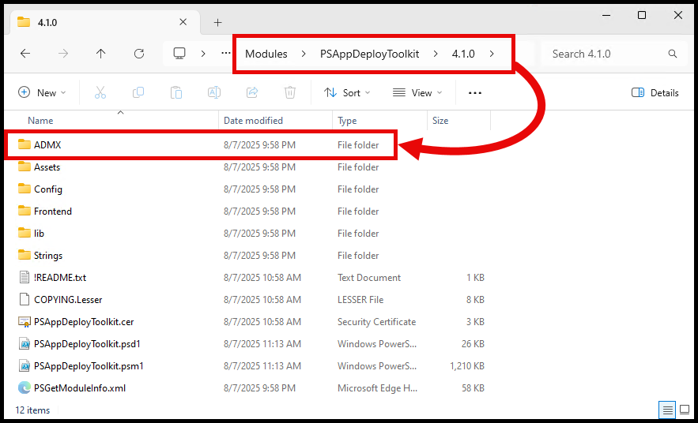
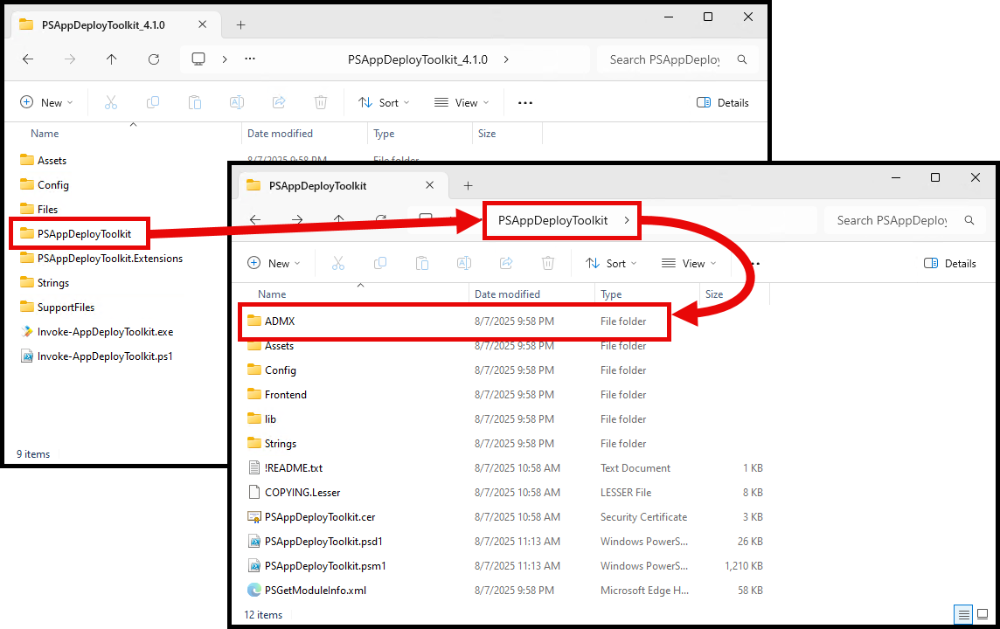
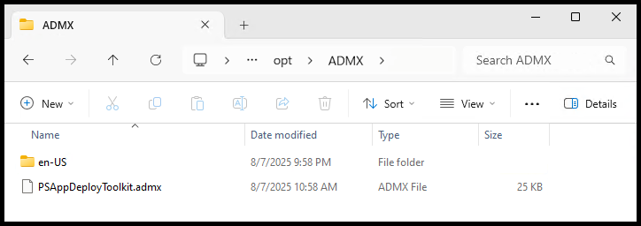
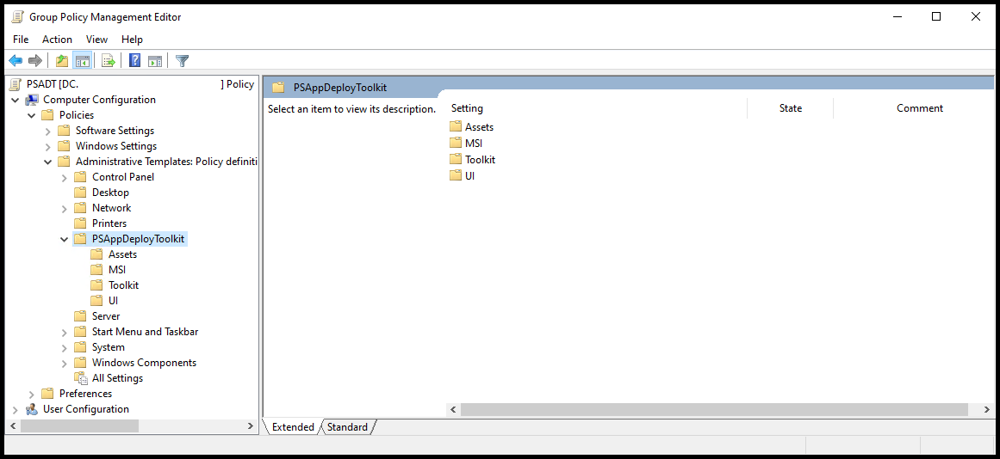
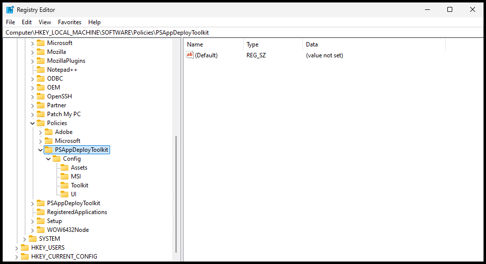

## How to configure the toolkit with Group Policy

The supplied ADMX templates let you change, update or enforce toolkit settings across an
organization, without editing `config.psd1` in every package.

Group Policy settings take precedence over the deployment's local config and over the built-in
defaults. See [Configuration](../explanation/configuration.mdx).

## Find the template files

The `ADMX` folder ships in two places. Either copy works.

In the module folder:



In the `PSAppDeployToolkit` folder of a deployment template:



It contains the language-neutral policy definitions and the `en-US` descriptions:

| Folder     | File                    | Purpose                                 |
| :--------- | :---------------------- | :-------------------------------------- |
| **ADMX/**  |                         |                                         |
|            | PSAppDeployToolkit.admx | Language-neutral policy settings file   |
| **en-US/** |                         |                                         |
|            | PSAppDeployToolkit.adml | en-US language policy descriptions file |



## Import the templates

Copy `PSAppDeployToolkit.admx` into your Central Store, and `en-US\PSAppDeployToolkit.adml` into the
matching language subfolder. You can also import both into Intune.

## Configure the settings

After importing, the settings appear in the Group Policy Management Editor under:

```text
Computer Configuration
└───Policies
    └───Administrative Templates: Policy definitions
        └───PSAppDeployToolkit
            ├───Assets
            ├───MSI
            ├───Toolkit
            └───UI
```



Which settings are available, and what they do, is listed in the
[Configuration Settings reference](../reference/config-settings.mdx).

## Verify the result

Applied policies land in the registry at:

```text
HKEY_LOCAL_MACHINE\SOFTWARE\Policies\PSAppDeployToolkit
```



The toolkit reads them as it initializes, so a deployment started after the policy applies picks
them up.

## Worked example

- [How to set the log path with Group Policy](../how-to/set-the-log-path-with-group-policy.mdx)
