## Set the log path with Group Policy

This guide creates a Group Policy Object that defines the log path for every PSAppDeployToolkit
deployment in scope, so you do not have to configure `config.psd1` in each package.

## Prerequisites

- The [ADMX templates are imported](../how-to/configure-with-group-policy.mdx) into your Central Store.
- Rights to create and link Group Policy Objects.

## 1. Create the Group Policy Object

Open the Group Policy Management Editor, right-click **Group Policy Objects** and select **New**.

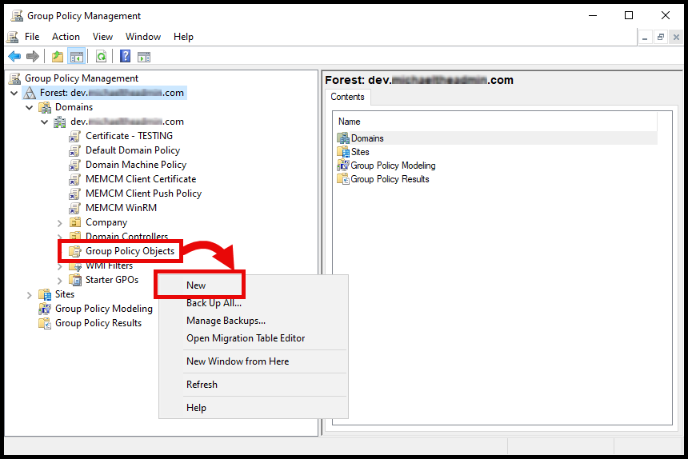

Give it a name. `PSADT 4.1` is used here.

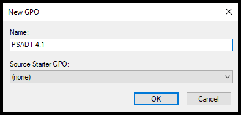

## 2. Configure the LogPath policy

Find the new GPO under **Group Policy Objects**, right-click it and select **Edit**.

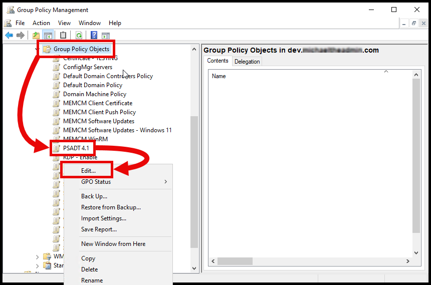

Navigate to **Toolkit**, right-click **LogPath** and select **Edit**:

```text
Computer Configuration
└───Policies
    └───Administrative Templates: Policy definitions
        └───PSAppDeployToolkit
            └───Toolkit
```

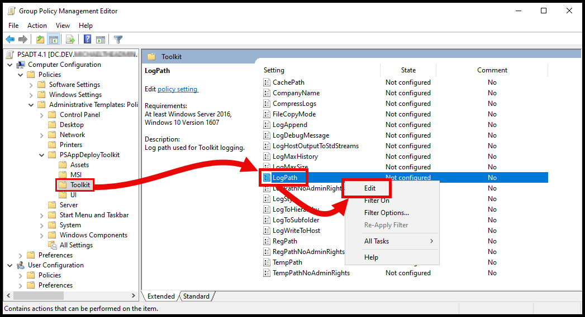

Select **Enable** and define the path. This example uses the Intune Management Extension log folder,
so PSADT logs are collected alongside Intune's own:

```powershell
$envProgramData\Microsoft\IntuneManagementExtension\Logs
```

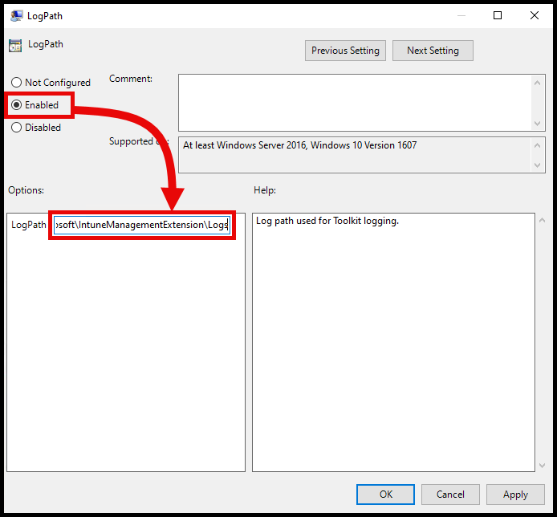

Select **OK**, configure any other policies you need, and close the editor.

## 3. Link the GPO

Navigate to the domain or OU you want the policy to apply to, right-click and select
**Link an Existing GPO...**

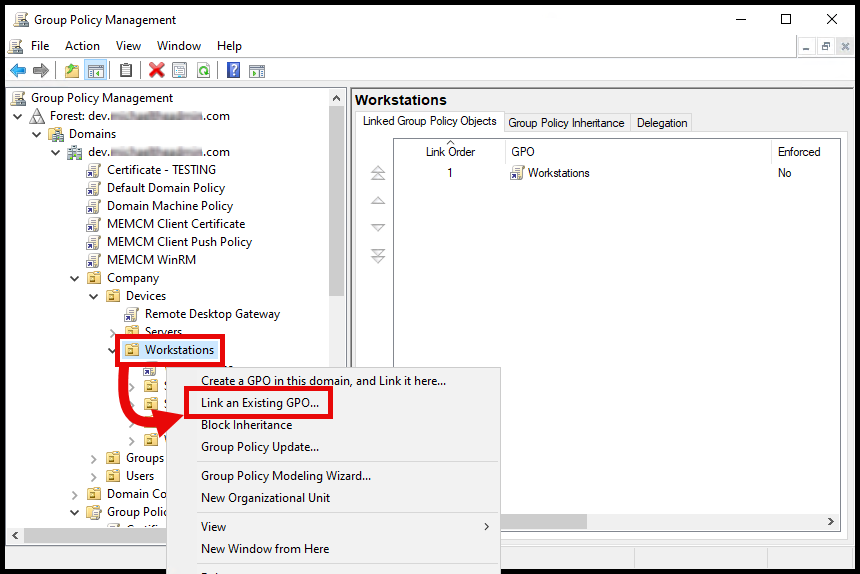

Select the GPO and click **OK**.

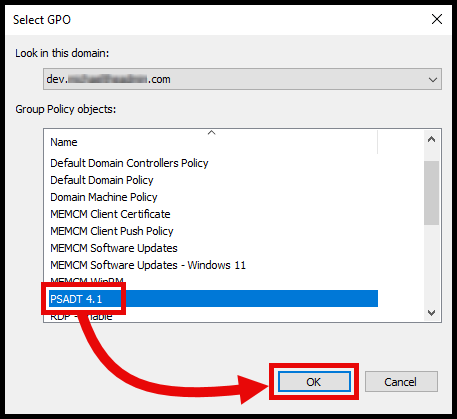

The GPO now appears linked at that location.

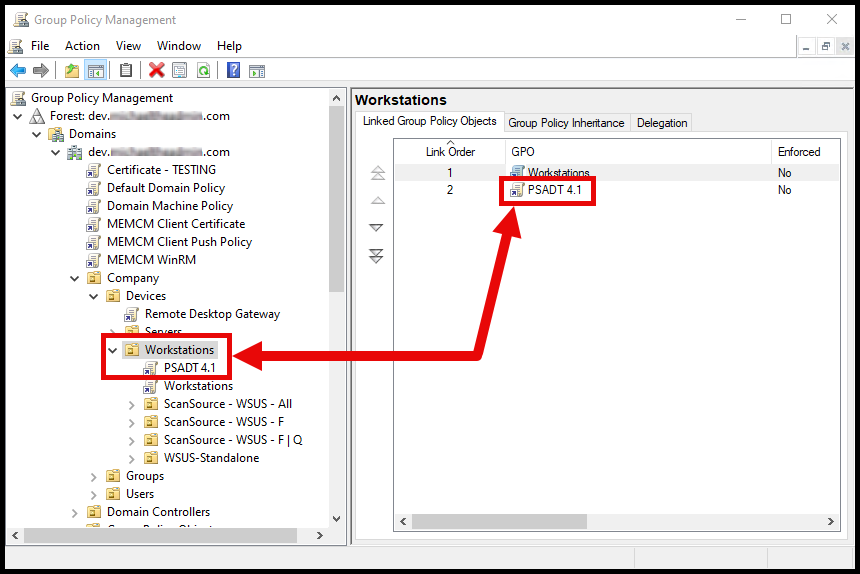

## 4. Apply and verify

On a machine in scope, refresh policy:

```text
gpupdate /force
```

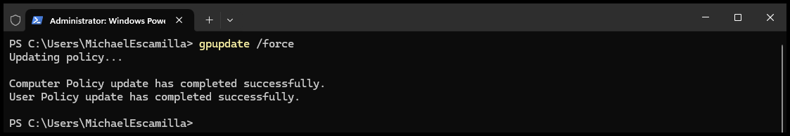

Confirm the GPO applied:

```text
gpresult /r /scope computer
```

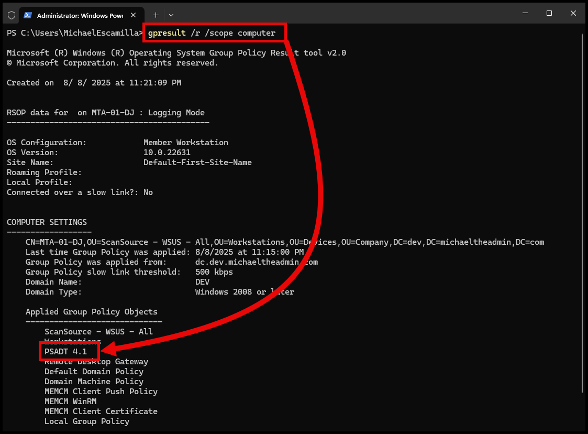

Confirm the setting reached the registry:

```text
Computer\HKEY_LOCAL_MACHINE\SOFTWARE\Policies\PSAppDeployToolkit\Config\Toolkit
```

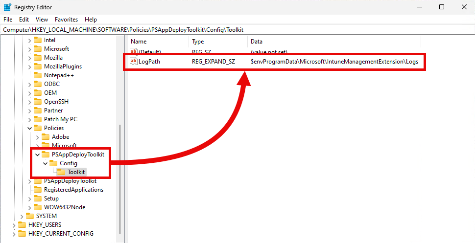

## 5. Run a deployment

The toolkit imports Group Policy settings as it initializes, so the next deployment writes its log
to the configured folder, in this case `ProgramData\Microsoft\IntuneManagementExtension\Logs`.

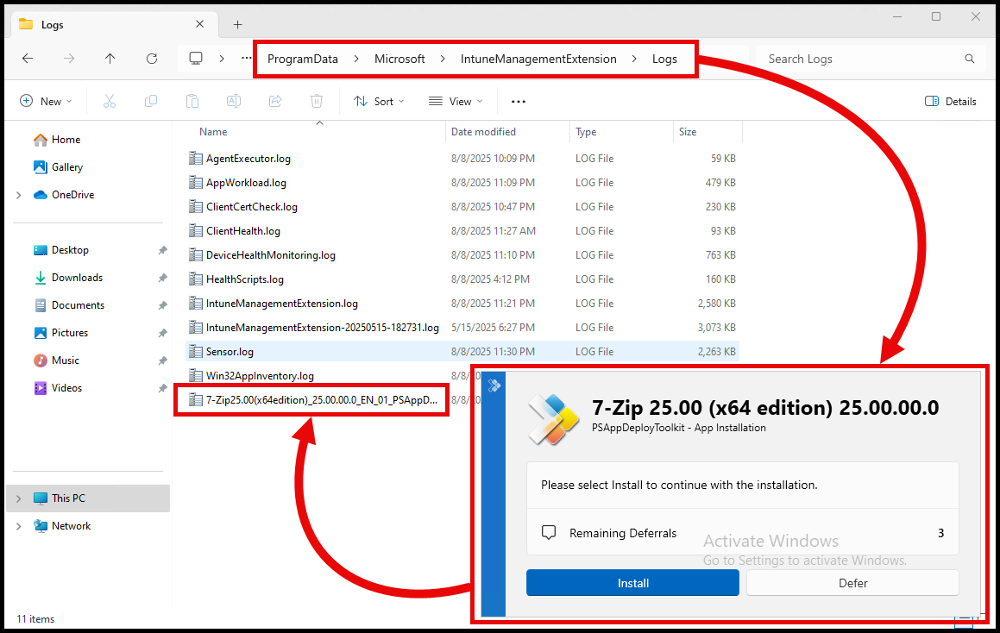

## Troubleshooting

### Logs still go to the old location

The deployment started before policy refreshed, or the machine is out of scope. Re-check
`gpresult /r /scope computer` and confirm the registry value exists.
