# Adding User Interface Elements

Work In Progress - Coming Soon!

{/* The user interface consists of several components detailed below. The user interface can be branded with a custom logo and banner.

All of the UI components include message text that is customizable in the `AppDeployToolkitConfig.xml`. The UI has been localized in 11 different languages: English, French, Spanish, Portuguese, German, Italian, Dutch, Swedish, Danish, Norwegian and Japanese. Additional languages can be easily added in the XML configuration file.

The language used by the PSAppDeployToolkit UI is selected automatically based on the language culture of the operating system, so the same `AppDeployToolkitConfig.xml` file can be used in a multi-language environment.

The user interface can be suppressed by specifying the deploy mode parameter as follows:

```powershell
Deploy-Application.ps1 -DeployMode "Silent"
```

### Installation Progress

The installation progress message displays an indeterminate progress ring to indicate an installation is in progress and display status messages to the end user. This is invoked using the `Show-InstallationProgress` Function.

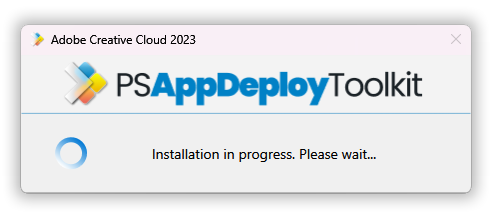

The progress message can be dynamically updated to indicate the stage of the installation or to display custom messages to the user, using the `Show-InstallationProgress` function.

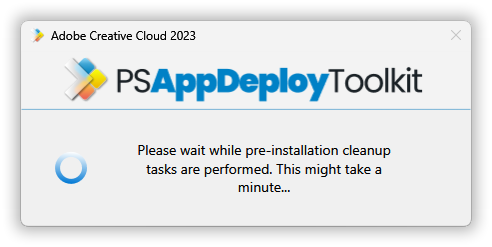

### Installation Welcome Prompt

The application welcome prompt can be used to display applications that need to be closed, an option to defer and a countdown to closing applications automatically. Use the `Show-InstallationWelcome` function to display the prompts shown below.

Welcome Prompt with the ability to defer a number of times:

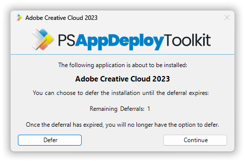

Welcome Prompt with the ability to close open programs:

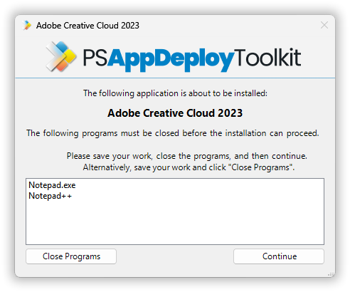

Welcome prompt with the ability to defer until a deadline is passed:

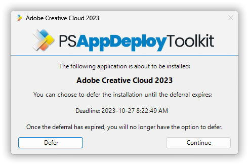

### Block Application Execution

If the block execution option is enabled (see `Show-InstallationWelcome` function), the user will be prompted that they cannot launch the specified application(s) while the installation is in progress. The application will be unblocked again once the installation has completed.

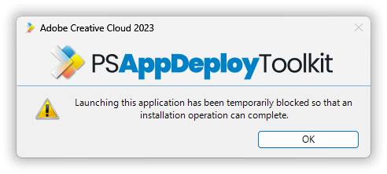

### Custom Installation Prompt

A custom prompt with the PSAppDeployToolkit branding can be used to display messages and interact with the user using the `Show-InstallationPrompt` function. The title and text is customizable and up to 3 customizable buttons can be included on the prompt as well as optional system icons.

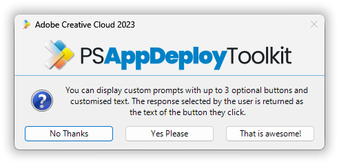

Additionally, the prompt can be displayed asynchronously, e.g. to display a message at the end of the installation but allow the installation to return the exit code to the parent process without waiting for the user to respond to the message.

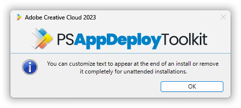

### Installation Restart Prompt

A restart prompt can be displayed with a countdown to automatic restart using the `Show-InstallationRestartPrompt`. Since the restart prompt is executed in a separate PowerShell session, the PSAppDeployToolkit will still return the appropriate exit code to the parent process.

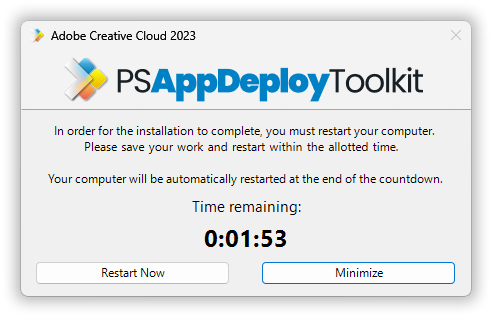

The dialog can be minimized, and it can also be configured to remain on-screen if the countdown has reached a certain time.

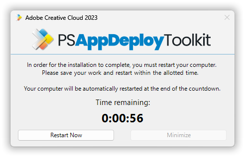

### Balloon Tip Notifications

Balloon tip notifications are displayed in the system tray automatically at the beginning and end of the installation. These can be turned off in the XML configuration.

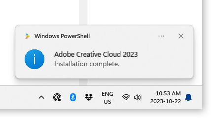

### Custom Dialog box

A generic dialog box to display custom messages to the user without the PSAppDeployToolkit branding using the function `Show-DialogBox`. This can be customized with different system icons and buttons.


### Toolkit Help Console

The PowerShell App Deployment Toolkit Help Console. This is a separate script and can be invoked by running `AppDeployToolkitHelp.ps1`

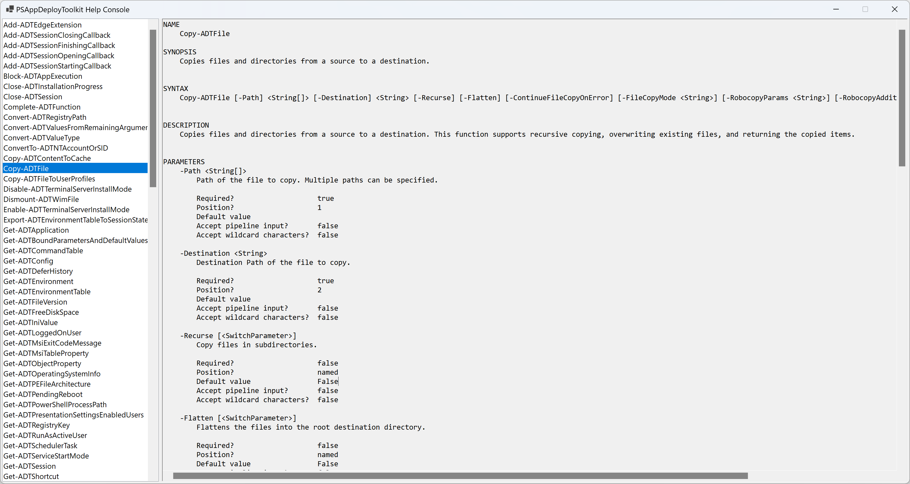 */}
