# Adding User Interface Elements

The user interface consists of several components detailed below. The user interface can be branded with a custom logo (Fluent UI) or banner (Classic UI).

All of the UI components include message text that is customizable in `strings.psd1`, which has been localized in 25 different languages.

The language is selected automatically based on the operating system settings, however the `LanguageOverride` setting inside `config.psd1` can be used to override this.

The user interface can be suppressed by specifying the deploy mode parameter as follows:

```powershell
Invoke-AppDeployToolkit.ps1 -DeployMode Silent
```

### Installation Progress

The installation progress message displays an indeterminate progress ring to indicate an installation is in progress and display status messages to the end user. This is invoked using the [Show-ADTInstallationProgress](/docs/reference/functions/Show-ADTInstallationProgress) Function.

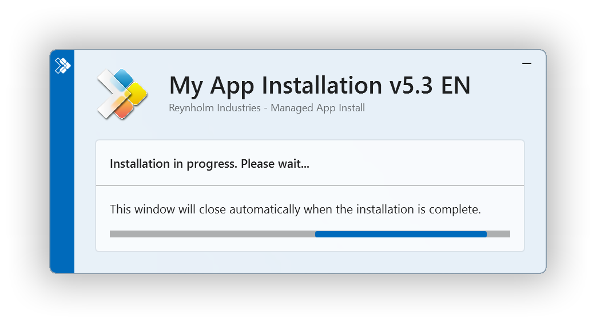

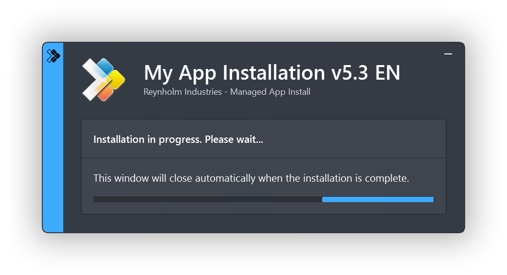

The progress message can be dynamically updated to indicate the stage of the installation or to display custom messages to the user, using the [Show-ADTInstallationProgress](/docs/reference/functions/Show-ADTInstallationProgress) function.

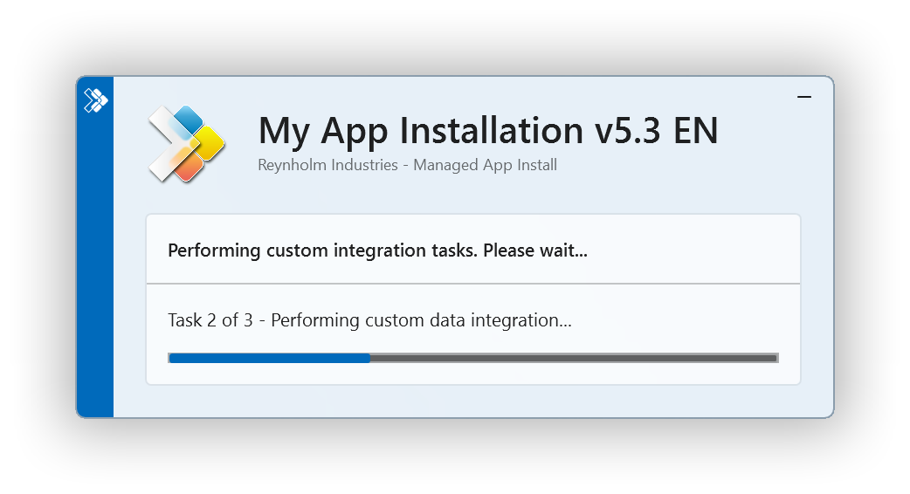

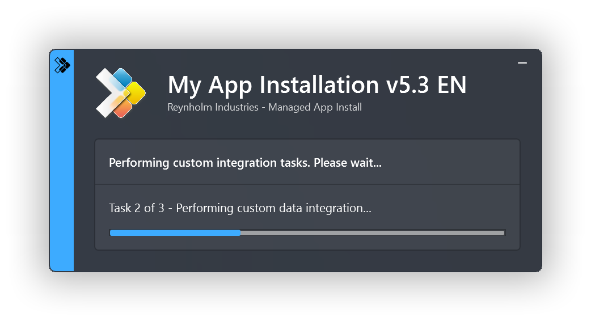

### Installation Welcome Prompt

The application welcome prompt can be used to display applications that need to be closed, an option to defer and a countdown to closing applications automatically. Use the [Show-ADTInstallationWelcome](/docs/reference/functions/Show-ADTInstallationWelcome) function to display the prompts shown below.

Welcome Prompt with the ability to defer a number of times:

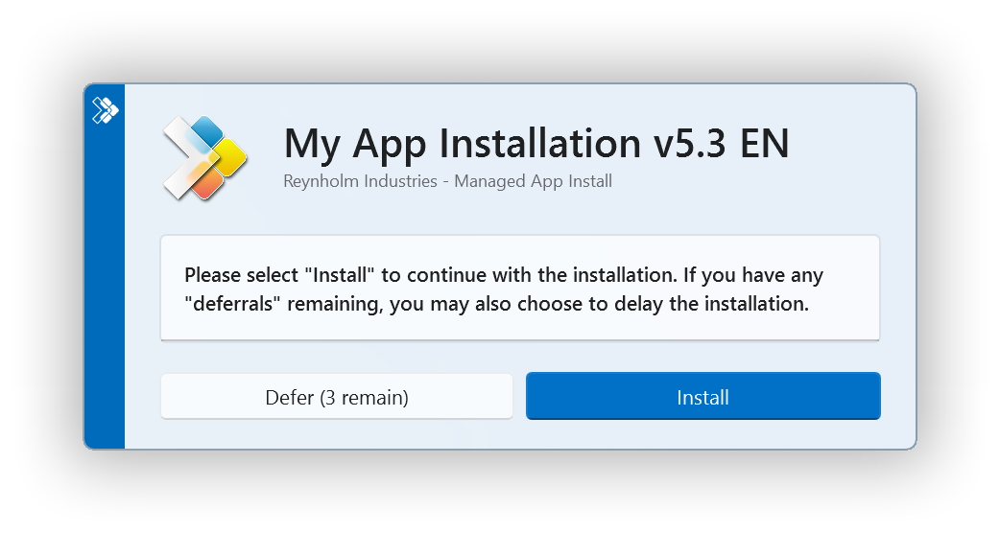

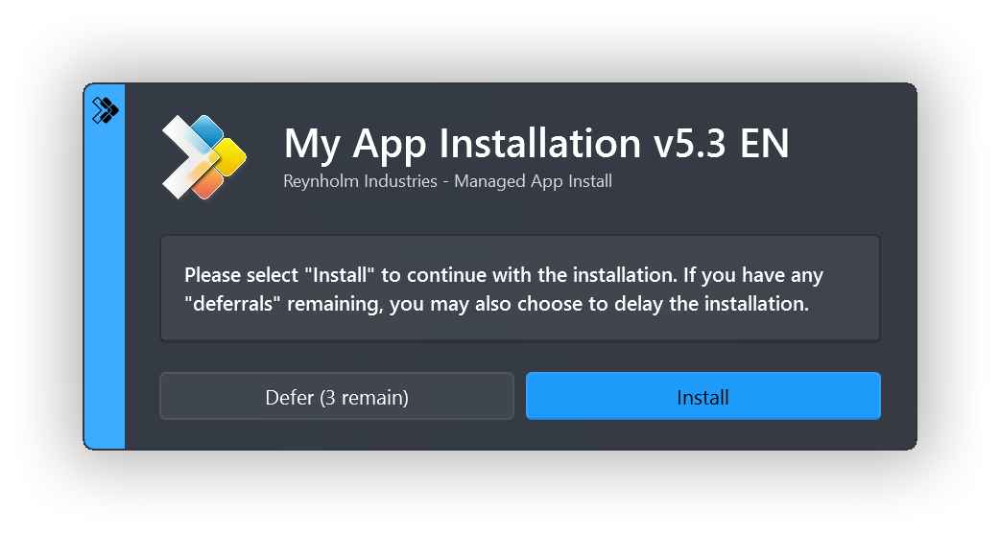

Welcome Prompt with the ability to close open programs:

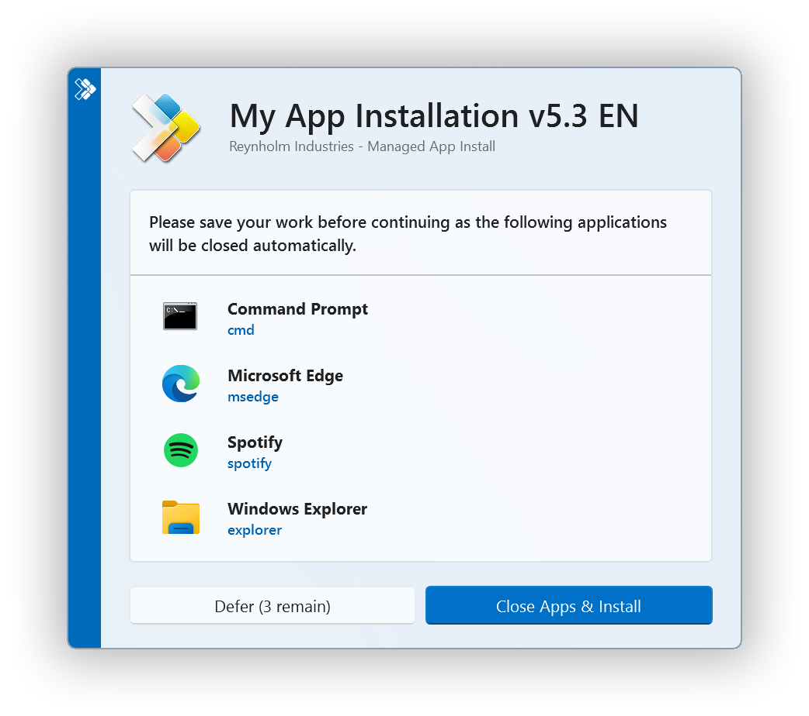

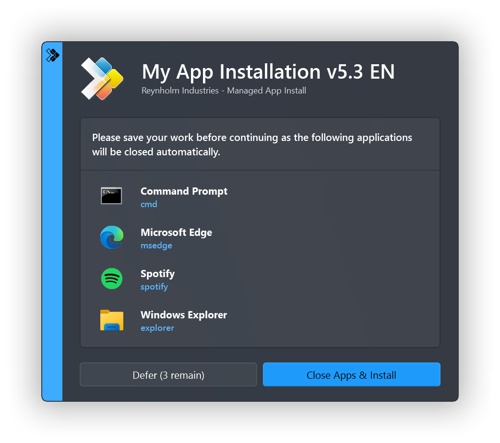

### Block Application Execution

If the block execution option is enabled (see [Show-ADTInstallationWelcome](/docs/reference/functions/Show-ADTInstallationWelcome)), the user will be prompted that they cannot launch the specified application(s) while the installation is in progress. The application will be unblocked again once the installation has completed.

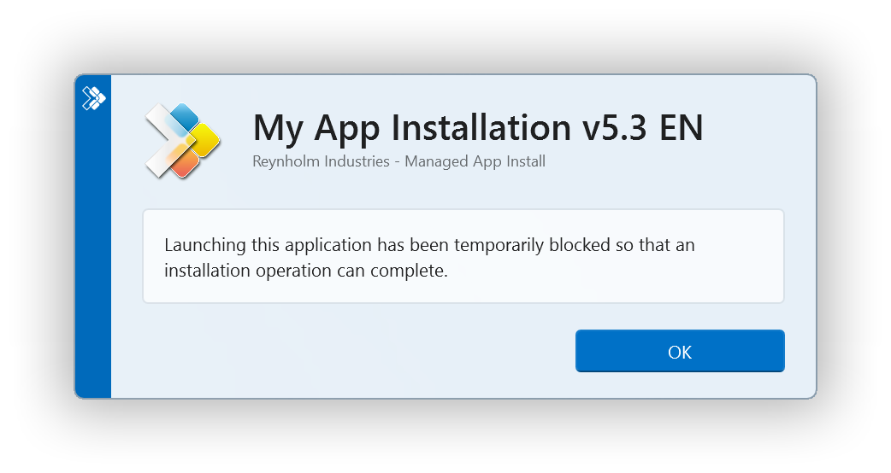

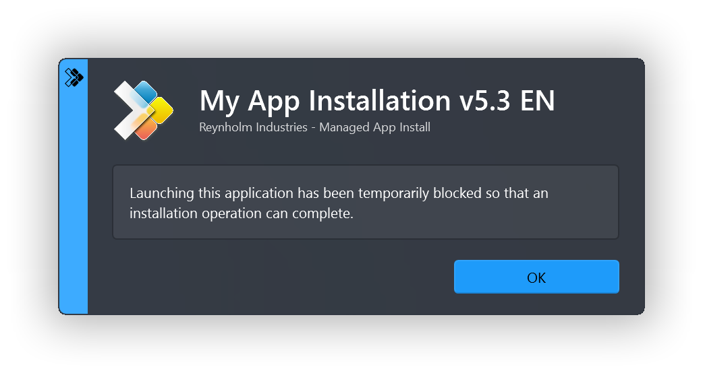

### Custom Installation Prompt

A custom prompt with the PSAppDeployToolkit branding can be used to display messages and interact with the user using the [Show-ADTInstallationPrompt](/docs/reference/functions/Show-ADTInstallationPrompt) function. The title and text is customizable and up to 3 customizable buttons can be included on the prompt as well as optional system icons.

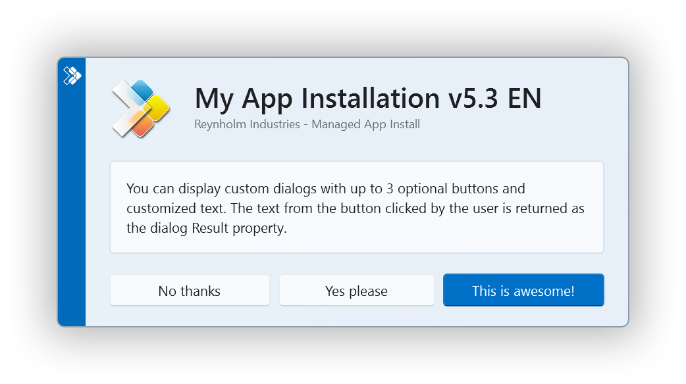

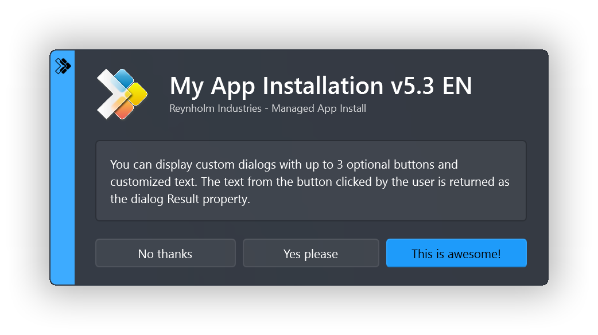

Additionally, the prompt can be displayed asynchronously, e.g. to display a message at the end of the installation but allow the installation to return the exit code to the parent process without waiting for the user to respond to the message.

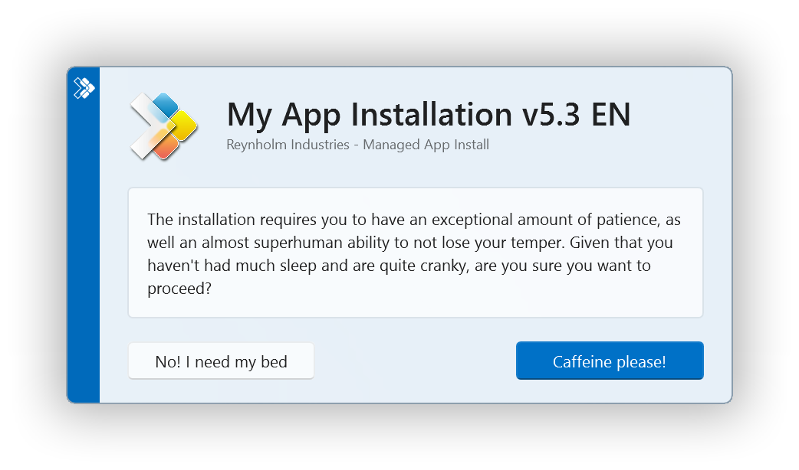

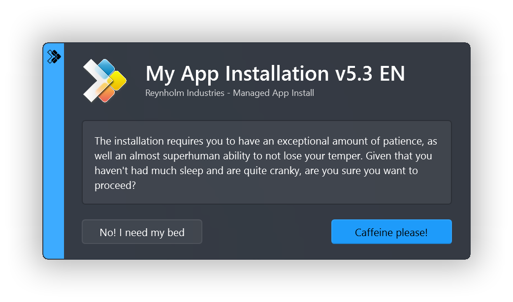

### Installation Restart Prompt

A restart prompt can be displayed with a countdown to automatic restart using the [Show-ADTInstallationRestartPrompt](/docs/reference/functions/Show-ADTInstallationRestartPrompt). Since the restart prompt is executed in a separate PowerShell session, the PSAppDeployToolkit will still return the appropriate exit code to the parent process.

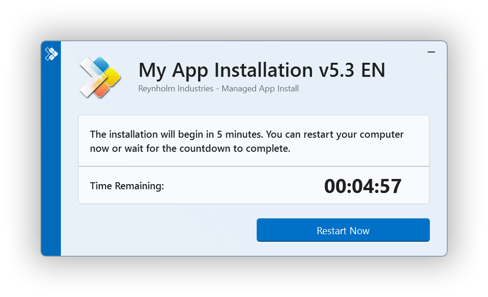

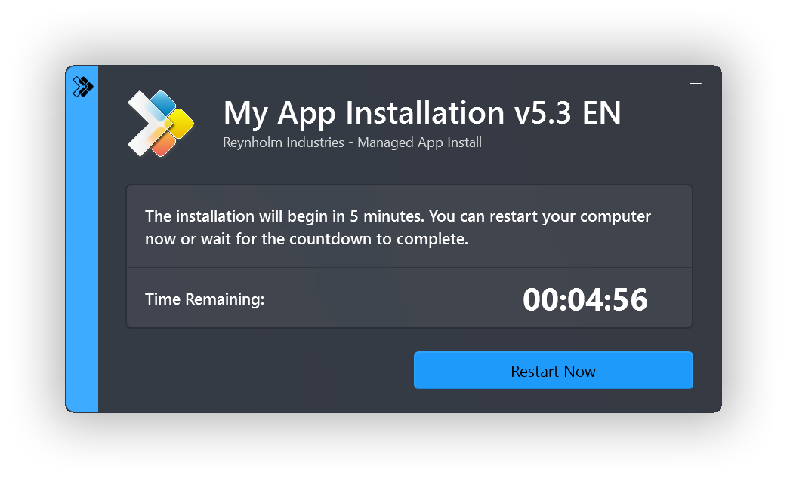

### Custom Dialog box

A generic dialog box to display custom messages to the user without the PSAppDeployToolkit branding using the function [Show-ADTDialogBox](/docs/reference/functions/Show-ADTDialogBox). This can be customized with different system icons and buttons.


### Toolkit Help Console

The PowerShell App Deployment Toolkit Help Console can be invoked by running the `Show-ADTHelpConsole` command.


