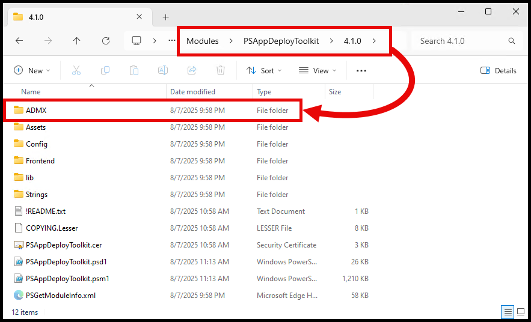
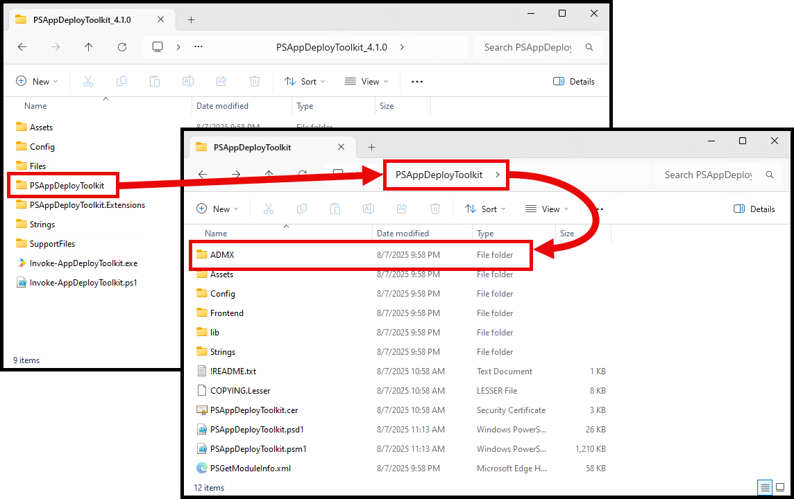
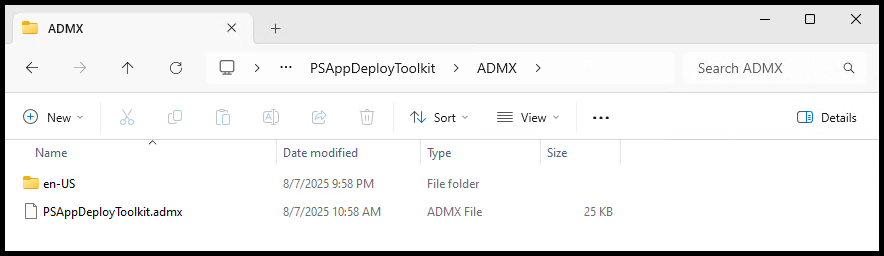
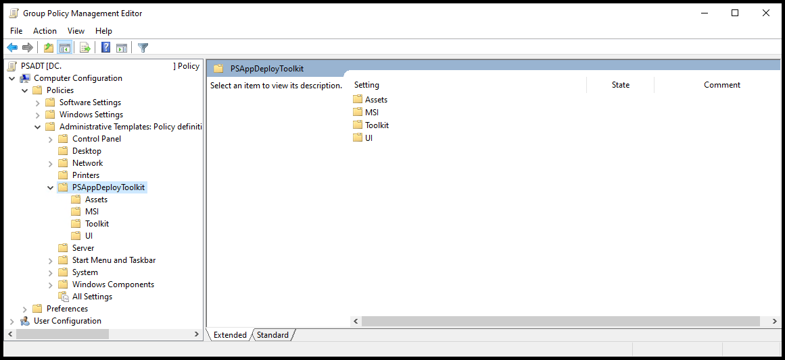
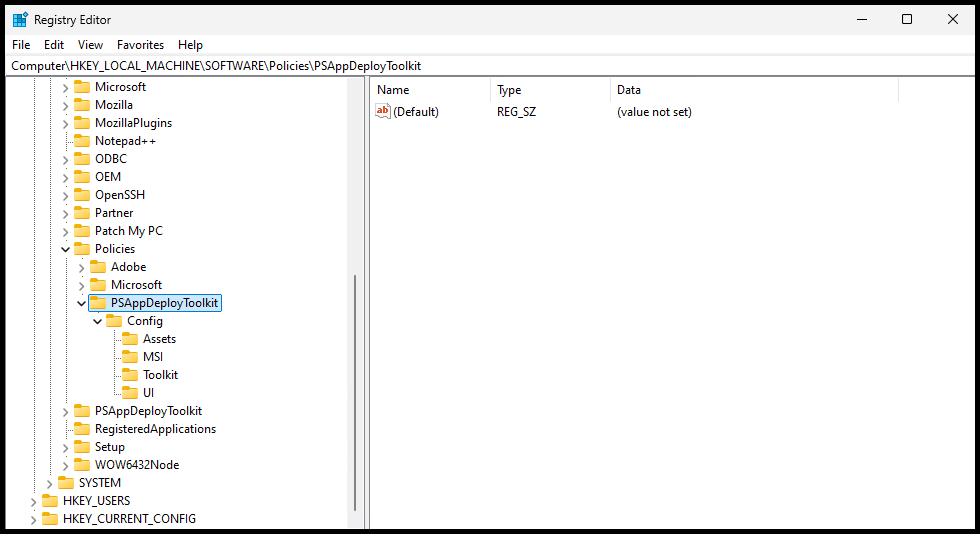

# Group Policy ADMX Templates

Another way to customize your deployments is with the supplied ADMX templates.

This is a great way to change, update, or enforce settings across an orginization.

## Config

The Group Policy settings will take precedence over local configs and built-in defaults.

See [Config Settings](../reference/config-settings.mdx) for additional information on what settings are configurable.

## ADMX Template Files

The ADMX Template files are located in the `ADMX` folder of either the Module, or the Deployment Template

### Module Folder

The `ADMX` folder is located in the root of the module folder:



### Deployment Template Folder

The `ADMX` folder is located in the `PSAppDeployToolkit` folder of a deployment template:



### Files

The `ADMX` folder contains both the `.admx` and `.adml` files. Use these files to import into either your Central Store or Intune

| Folder                  | File                    | Purpose                                 |
|:------------------------|:------------------------|:----------------------------------------|
| **ADMX/**               |                         |                                         |
|                         | PSAppDeployToolkit.admx | Language neutal policy settings file    |
| **en-US/**              |                         |                                         |
|                         | PSAppDeployToolkit.adml | en-US language policy descriptions file |



## Group Policy Management Editor

After importing the files into your central store, you can view the settings under:
```
Computer Configuration
└───Policies
    └───Administrative Templates: Policy definitions
        └───PSAppDeployToolkit
            ├───Assets
            ├───MSI
            ├───Toolkit
            └───UI
```



## Registry

When the Policies apply, the policies can be found in the Registry here:

```
HKEY_LOCAL_MACHINE\SOFTWARE\Policies\PSAppDeployToolkit
```

